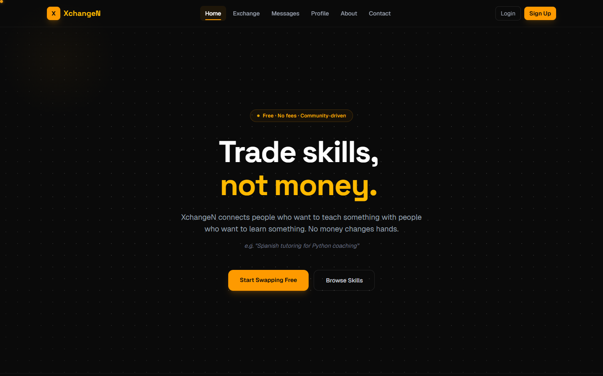
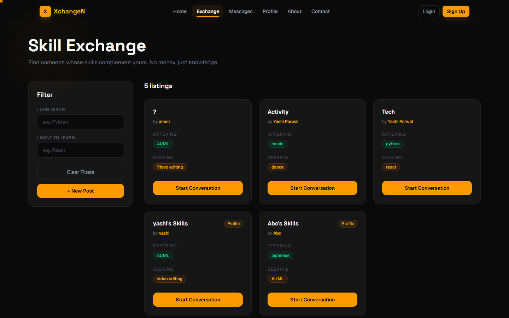
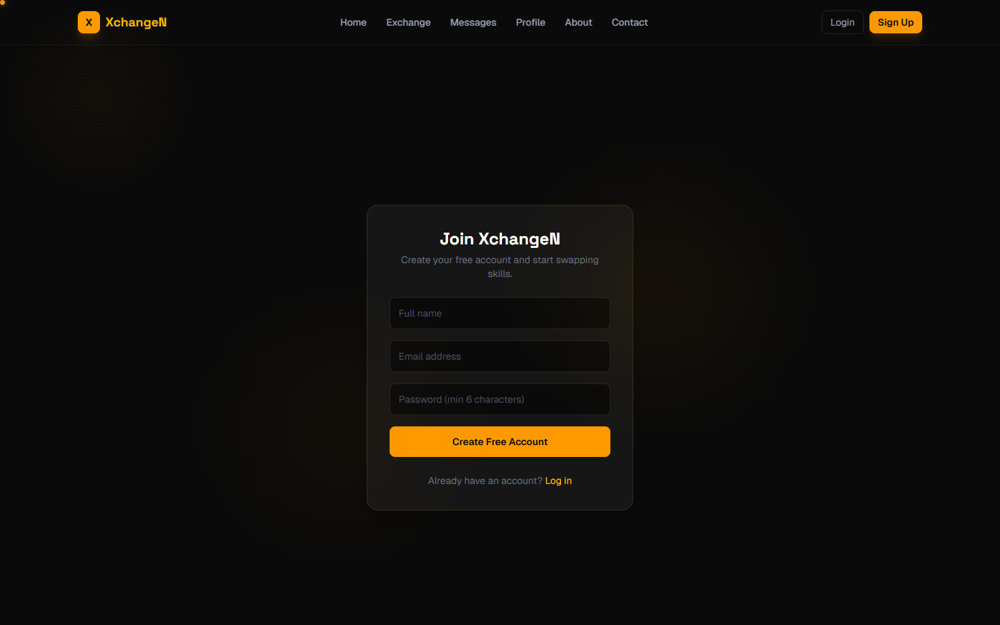
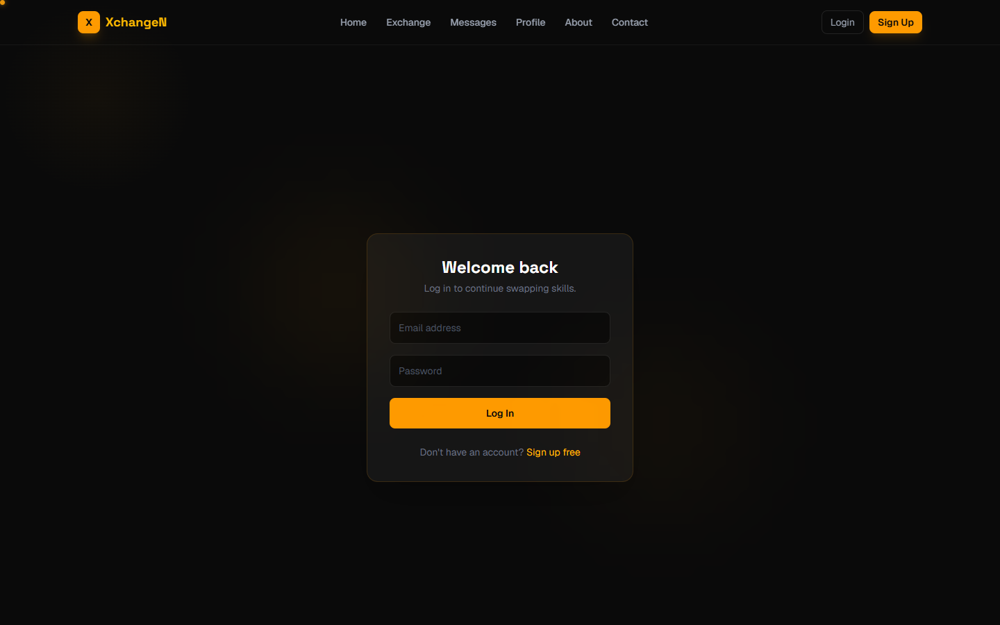
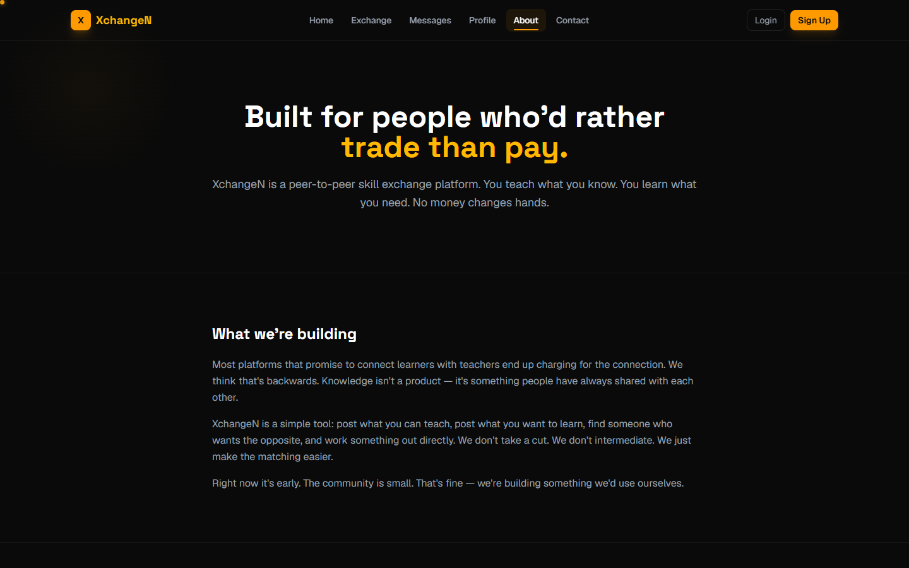

<div align="center">


# 🔄 ExchangeN — Trade Skills, Not Money

**Teach what you know. Learn what you don't.**
Find someone whose skills complement yours, and swap.

[](https://frontend-green-three-51.vercel.app)
[](https://github.com/YashiBuildss/ExchangeN/stargazers)
[](https://github.com/YashiBuildss/skill-swap-backend)
[](https://socket.io/)

</div>

---

## 🚀 What is ExchangeN?

**ExchangeN** is a skill-swapping platform — instead of paying for lessons, you trade what you're good at for what you want to learn. Post what you can teach and what you're looking for, get matched with people who complement your skillset, and chat in real time to make it happen.

> *"You know guitar, they know Spanish. Everybody teaches, everybody learns."*

---

## 🎥 Features at a Glance

| Feature | Description |
|---|---|
| 🔐 **Auth** | Secure signup/login with JWT |
| 🧩 **Skill Matching** | Post what you offer and what you're seeking; browse matching listings from other users |
| 📝 **Posts Feed** | Share and browse skill-swap opportunities |
| 👤 **Profiles** | Editable bio, location, and profile picture |
| 💬 **Real-time Chat** | Text, file, and voice messages with typing indicators and online status |
| 📞 **Voice/Video Calls** | WebRTC calling, signaled over Socket.io |

---

## 🖥️ Screenshots

<details>
<summary>🏠 Home Page</summary>
<br/>


> Hero, value pitch, and calls to action

</details>

<details>
<summary>🧩 Skill Exchange</summary>
<br/>


> Browse and filter skill-matching listings from other users

</details>

<details>
<summary>📝 Sign Up</summary>
<br/>


> Create a free account to start swapping

</details>

<details>
<summary>🔑 Log In</summary>
<br/>


> Return and continue swapping skills

</details>

<details>
<summary>ℹ️ About</summary>
<br/>


> What XchangeN is building and why

</details>

---

## 🛠️ Tech Stack

**Frontend**


**Realtime**


**Backend & Storage** ([separate repo](https://github.com/YashiBuildss/skill-swap-backend))


**Deployment**


---

## ⚡ Getting Started

```bash
# 1. Clone the repository
git clone https://github.com/YashiBuildss/ExchangeN.git

# 2. Navigate into the project
cd ExchangeN

# 3. Install dependencies
npm install

# 4. Set up environment variables
cp .env.local.example .env.local   # or create it manually, see below

# 5. Run the development server
npm run dev
```

Open [http://localhost:3000](http://localhost:3000) in your browser. You'll also need the [backend](https://github.com/YashiBuildss/skill-swap-backend) running — either locally or pointed at a deployed instance.

---

## 🔑 Environment Variables

Create a `.env.local` file in the root:

```env
NEXT_PUBLIC_API_URL=http://localhost:5000
```

Point this at your backend's URL — locally or deployed.

---

## 📁 Project Structure

```
ExchangeN/
├── src/
│   ├── app/
│   │   ├── page.jsx              # Home page
│   │   ├── signup/, login/       # Auth
│   │   ├── profile/, edit/       # User profile
│   │   ├── exchange/             # Skill listings
│   │   ├── create_post/          # Posts feed
│   │   ├── chat/[id]/            # Real-time chat + calls
│   │   ├── messages/             # Conversation list
│   │   └── aboutus/, contact/    # Static pages
│   ├── components/               # Reusable components
│   ├── context/                  # Auth & call context providers
│   └── lib/                      # API client, socket, utilities
└── public/                       # Static assets
```

---

## 🤝 Contributing

Contributions are welcome! Feel free to open an issue or submit a pull request.

1. Fork the repo
2. Create your feature branch (`git checkout -b feature/amazing-feature`)
3. Commit your changes (`git commit -m 'Add amazing feature'`)
4. Push to the branch (`git push origin feature/amazing-feature`)
5. Open a Pull Request

---

## 📬 Contact

<a href="https://mail.google.com/mail/?view=cm&to=yashiporwal.dev@gmail.com">
  
</a>
<a href="https://www.linkedin.com/in/yashi-porwal/">
  
</a>

---

<div align="center">

Made with 💜 by [Yashi Porwal](https://github.com/YashiBuildss)

⭐ Star this repo if you found it helpful!

</div>
